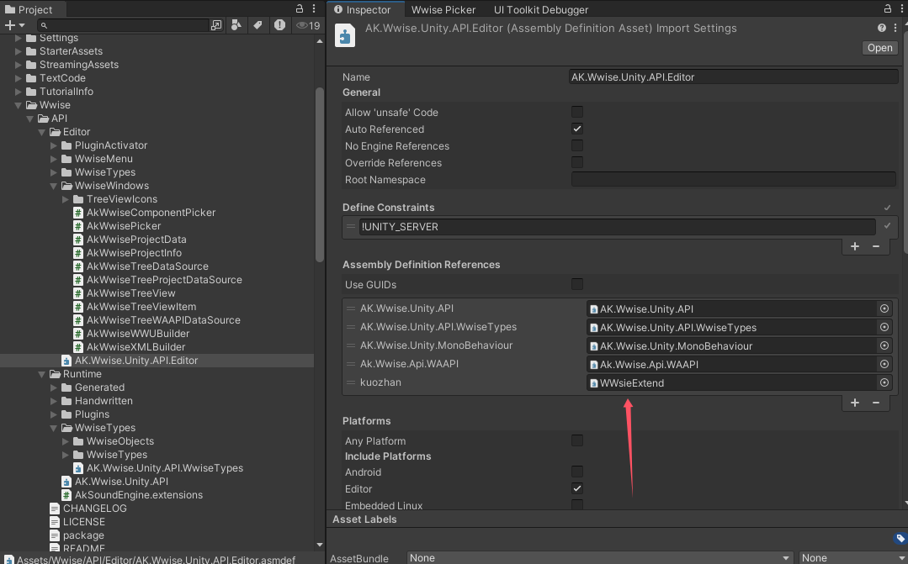
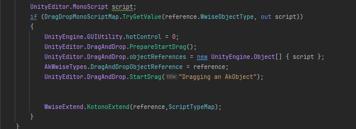
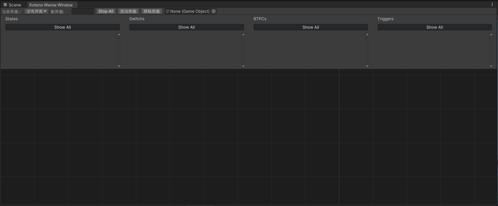

# KotonoGraph

这个Graph 将会继承Wwise，Render feature
用于对话系统、音频系统
允许Graph Node 调用渲染后处理、Wwise AK 库

This Graph will inherit the Wwise, Render feature
Used for dialogue systems and audio systems
Allows Graph Node to call post-render processing, Wwise AK library


#### Wwise Window

怎么去使用这个工具，扩展Wwise Piker 的拖拽，因此你需要修改一下程序集



随后修改源码

```c++
protected override void SetupDragAndDrop(SetupDragAndDropArgs args)
	{
		UnityEditor.DragAndDrop.PrepareStartDrag();

		var draggedRows = GetRows().Where(item => args.draggedItemIDs.Contains(item.id)).ToList();
		var draggedItem = draggedRows[0] as AkWwiseTreeViewItem;
		if (draggedItem.objectGuid == System.Guid.Empty ||
			draggedItem.objectType == WwiseObjectType.Bus ||
			draggedItem.objectType == WwiseObjectType.PhysicalFolder ||
			draggedItem.objectType == WwiseObjectType.Folder ||
			draggedItem.objectType == WwiseObjectType.WorkUnit ||
			draggedItem.objectType == WwiseObjectType.Project ||
			draggedItem.objectType == WwiseObjectType.StateGroup ||
			draggedItem.objectType == WwiseObjectType.SwitchGroup)
			return;

	


		var reference = WwiseObjectReference.FindOrCreateWwiseObject(draggedItem.objectType, draggedItem.name, draggedItem.objectGuid);
		if (!reference)
			return;

		var groupReference = reference as WwiseGroupValueObjectReference;
		if (groupReference)
		{
			var parent = draggedItem.parent as AkWwiseTreeViewItem;
			groupReference.SetupGroupObjectReference(parent.name, parent.objectGuid);
		}

		UnityEditor.MonoScript script;
		if (DragDropMonoScriptMap.TryGetValue(reference.WwiseObjectType, out script))
		{
			UnityEngine.GUIUtility.hotControl = 0;
			UnityEditor.DragAndDrop.PrepareStartDrag();
			UnityEditor.DragAndDrop.objectReferences = new UnityEngine.Object[] { script };
			AkWwiseTypes.DragAndDropObjectReference = reference;
			UnityEditor.DragAndDrop.StartDrag("Dragging an AkObject");
			
			
			WwiseExtend.KotonoExtend(reference,ScriptTypeMap);
		}
	}
```



然后你就可以正常使用了，我会给你提供窗口

